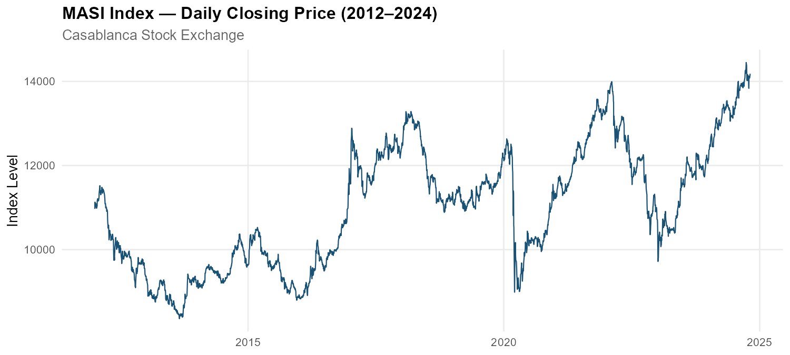
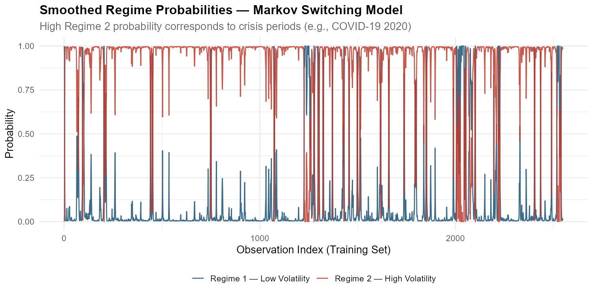
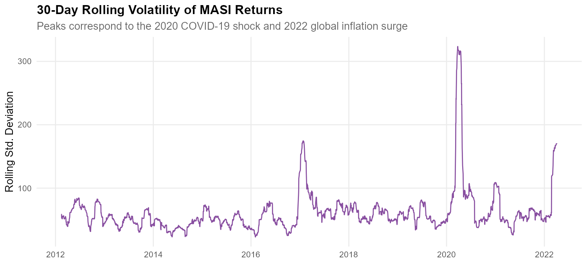

# MASI Index Forecasting: ARIMA vs Markov Switching Models

A time series analysis and forecasting study of the **Moroccan All Shares Index (MASI)** using classical econometric models, comparing the predictive performance of ARIMA and Markov Switching approaches on 12+ years of daily stock market data.

---
## Preview




---

## Objective

Stock market forecasting is hard prices are noisy, nonlinear, and prone to sudden regime shifts. This project investigates whether a **regime-aware model (Markov Switching)** can outperform a classical **linear model (ARIMA)** on the Moroccan stock market, and what each approach reveals about market dynamics.

---

## Dataset

| Property | Detail |
|---|---|
| **Source** | [Bourse de Casablanca](https://www.casablanca-bourse.com) (official Moroccan stock exchange) |
| **Index** | MASI — Moroccan All Shares Index |
| **Coverage** | January 2, 2012 → October 25, 2024 |
| **Observations** | 3,187 daily trading records |
| **Features** | Date, Closing Price, Open, High, Low, Daily % Change |
| **Split** | 80% training (2,549 obs) / 20% test (638 obs) |

The MASI is a free float capitalization weighted index covering all listed shares on the Casablanca Stock Exchange, making it the primary benchmark for Morocco's equity market.

---

## Methodology

### Step 1 — Data Preparation
- Cleaned and formatted raw CSV (date parsing, numeric reformatting, column removal)
- Converted to `xts` time series object for temporal analysis
- Applied **first-order differencing** to achieve stationarity
- Confirmed stationarity via **ADF, KPSS, and Phillips-Perron tests**

### Step 2 — Exploratory Analysis
- Visual inspection of price trends and return volatility
- ACF/PACF analysis to identify model order candidates
- Rolling 30 day volatility plot to detect clustering

### Step 3 — ARIMA Modeling
- **Auto ARIMA**: automated selection via AIC/BIC → identified ARIMA(1,1,3)
- **Manual ARIMA(2,1,2)**: alternative specification for comparison
- Residual diagnostics using Ljung-Box test and ACF of residuals

### Step 4 — Markov Switching Model
- **MS-AR(1) with 2 regimes**: low volatility vs high-volatility market states
- Estimated via EM algorithm using the `MSwM` package in R
- Extracted **transition probability matrix**, regime specific coefficients, and smoothed regime probabilities (Kim Smoother)

### Step 5 — Model Comparison
- Compared models on MAE and RMSE (on test set)
- Interpreted regime dynamics and practical implications

---

## Tools & Packages

| Tool | Purpose |
|---|---|
| **R** | Core analysis language |
| `forecast` | ARIMA fitting and forecasting |
| `tseries` | Stationarity tests (ADF, KPSS, PP) |
| `MSwM` | Markov Switching model estimation |
| `xts` / `zoo` | Time series data handling |
| `ggplot2` | Publication-quality visualizations |
| `Metrics` | MAE / RMSE computation |

---

##  Key Results

### Model Performance Comparison

| Model | AIC | BIC | MAE | RMSE |
|---|---|---|---|---|
| ARIMA(1,1,3) | 28,998.61 | 29,027.83 | 12,884.38 | 12,884.62 |
| ARIMA(2,1,2) | 29,012.09 | 29,041.30 | 12,884.63 | 12,884.88 |
| Markov Switching (2-Regime) | -177,542.86 | -177,519.49 | **48.34** | **73.57** |

>  **Note**: AIC/BIC values are computed on different scales across model types and are not directly comparable. MAE and RMSE on the differenced series are the meaningful cross-model metrics.

### Regime Transition Probabilities

|  | → Low Volatility | → High Volatility |
|---|---|---|
| **From Low Volatility** | 0.95 | 0.05 |
| **From High Volatility** | 0.10 | 0.90 |

Both regimes show **high persistence** — once the market enters a state (stable or volatile), it tends to stay there for extended periods. Regime transitions are rare and typically triggered by macroeconomic shocks.

### Key Findings

- **ARIMA** captures linear dependencies efficiently and is suitable for short-term forecasting under stable conditions
- **Markov Switching** dramatically outperforms ARIMA on error metrics and provides richer structural insights by modeling two distinct market states
- The **2020 COVID-19 shock** is clearly visible as a Regime 2 (high volatility) period in the smoothed probability plots
- ARIMA's flat long-horizon forecast is a known limitation; Markov Switching adapts to prevailing regime conditions

---

##  Project Structure

```
masi-forecasting/
│
├── data/
│   ├── raw/                  # Original CSV from Casablanca Bourse
│   └── processed/            # Cleaned RDS file for modeling
│
├── scripts/
│   ├── 01_data_preparation.R      # Load, clean, difference, test stationarity
│   ├── 02_exploratory_analysis.R  # Visualizations and ACF/PACF plots
│   ├── 03_arima_modeling.R        # Auto and manual ARIMA fitting + forecasts
│   ├── 04_markov_switching.R      # MS-AR(1) model, regime probabilities
│   └── 05_model_comparison.R      # Combined metrics table and comparison plot
│
├── figures/                  # All output plots (PNG)
├── outputs/                  # CSV metrics tables
└── README.md
```

---

##  How to Reproduce

1. **Clone the repository**
   ```bash
   git clone https://github.com/YOUR_USERNAME/masi-forecasting.git
   cd masi-forecasting
   ```

2. **Place the raw data file** in `data/raw/MASI_DATA.csv`

3. **Run scripts in order** from the project root:
   ```r
   source("scripts/01_data_preparation.R")
   source("scripts/02_exploratory_analysis.R")
   source("scripts/03_arima_modeling.R")
   source("scripts/04_markov_switching.R")
   source("scripts/05_model_comparison.R")
   ```
   Each script saves its outputs automatically to `figures/` and `outputs/`.

4. **Required R packages** are installed automatically at the top of each script.

---

##  Future Work

- **Hybrid MS-ARIMA model**: combine regime detection with ARIMA-based forecasting within each regime
- **GARCH volatility modeling**: add conditional heteroskedasticity to better model the volatility clustering observed in returns
- **Macroeconomic features**: incorporate oil prices, exchange rates, and policy events as exogenous variables
- **Machine learning comparison**: benchmark against XGBoost or LSTM on the same test set
- **Real-time regime classification**: implement a live dashboard that flags the current market regime

---

##  References

- Hamilton, J. D. (1989). *A new approach to the economic analysis of nonstationary time series and the business cycle.* Econometrica, 57(2), 357–384.
- Box, G. E. P., Jenkins, G. M., & Reinsel, G. C. (2015). *Time Series Analysis: Forecasting and Control.* Wiley.
- Kim, C. J., & Nelson, C. R. (1999). *State-Space Models with Regime Switching.* MIT Press.
- Hyndman, R. J., & Athanasopoulos, G. (2021). *Forecasting: Principles and Practice.* OTexts.

---

##  Author

**El Oumami Majda** — Applied Econometrics & Financial Data Analysis  
Submitted as part of coursework at ISEG ULisboa, December 2024  
 Lisbon, Portugal

---

*Data sourced from [La Bourse de Casablanca](https://www.casablanca-bourse.com) — the official Moroccan stock exchange.*
